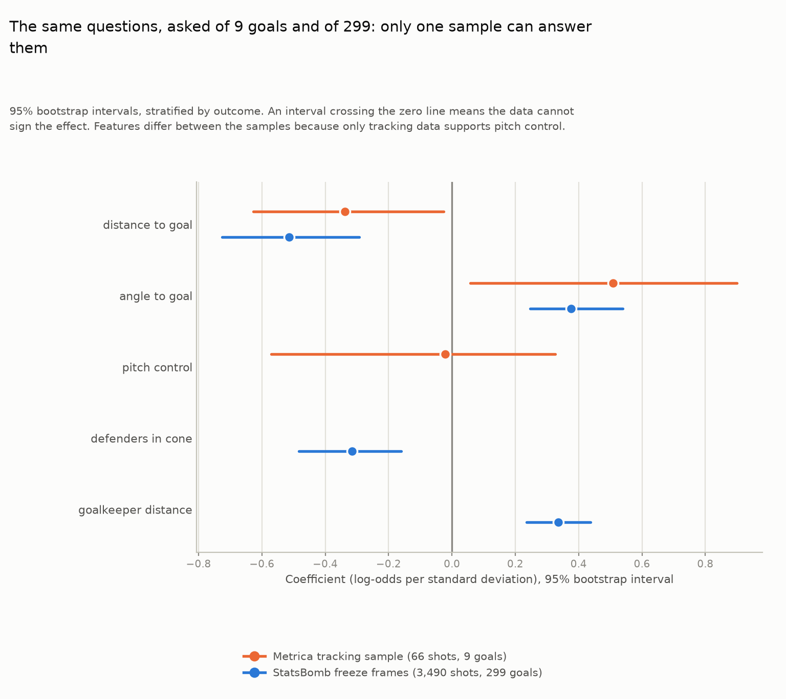
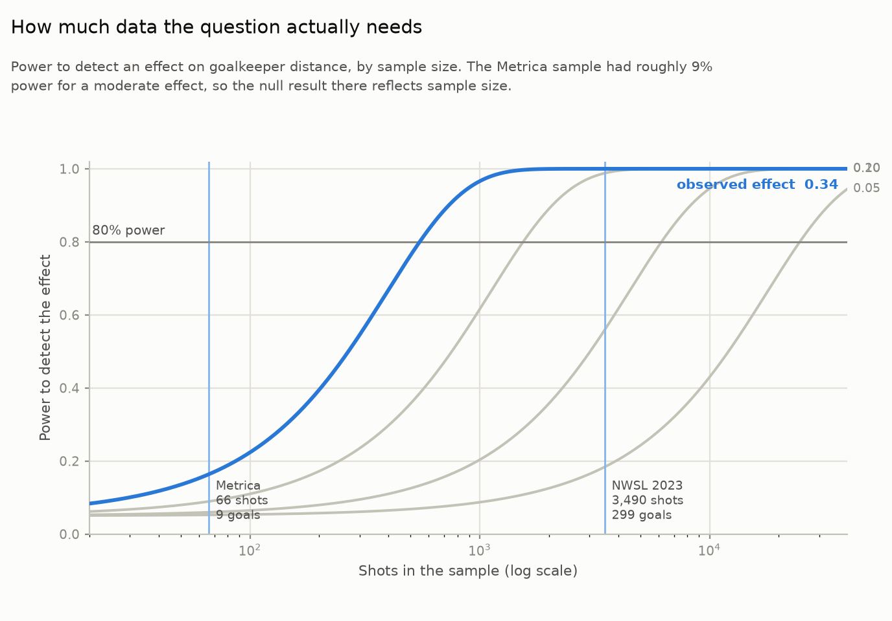

# Beyond Basic xG: A Pitch-Control-Informed Shot Quality Model

**Does a shot's quality depend on more than distance and angle? This project uses player-tracking and freeze-frame data to test whether defensive pressure and space at the moment of a shot change how good a chance actually was.**
(reports/figures/06_pitch_control_at_shot.png)

Everything here is built on public data. Two of the samples are small, so each result is stated together with what its sample can and cannot support. See [METHODOLOGY.md](METHODOLOGY.md) for the principles behind that.

## The idea

Standard expected goals (xG) models score a shot mostly on **distance and angle to goal**, sometimes adding body part and shot type. That is a good baseline, but it ignores the defence. A shot from 18 yards with a covered lane and three defenders closing in is a different chance from the same shot with the goalkeeper stranded and nobody nearby.

This project adds defensive context to a basic model and asks two questions: does it change which shots look high or low quality, and does it separate goals from misses any better?

**The answer depends on how much data you ask.** On the 66-shot tracking sample (9 goals), adding pitch control moves almost nothing and its confidence interval straddles zero. On 3,490 shots with 299 goals, defender and goalkeeper positions have a clear effect and lift AUC from 0.72 to 0.76. A power analysis shows the small sample had about 9% power, so its null result says little either way. The details are under [Findings](#findings).

## Data sources and limitations

These limits decide what every later result can claim.

| Data source | What it contains | What it is used for | Key limitation |
|---|---|---|---|
| **Metrica Sports open sample data** ([metrica-sports/sample-data](https://github.com/metrica-sports/sample-data)) | 25fps tracking of all 22 players and the ball, with synced events, for 3 full anonymized matches | The pitch-control model. This is the only source here with continuous player positions, so it is the only one where pitch control at the moment of a shot can be computed. | **Very few goals.** 68 shots and 10 goals across the three games (24, 24 and 20 shots, one of them a penalty). Any model fit on this is a methodology demonstration, not a validated predictive model. |
| **StatsBomb open data, 2023 NWSL season** (competition_id=49, season_id=107) | Event data for every 2023 NWSL match: shot location, body part and xG, plus a `shot.freeze_frame` on 99% of shots listing every player in camera view at the instant of the shot | Validating the basic distance and angle model against StatsBomb's published xG, and testing the defender-context features on 3,490 shots with 299 goals | **No continuous tracking.** A freeze frame is a single instant with no velocities, and it shows only the players in camera view (a median of 9 opponents). Spearman pitch control and whole-pitch Voronoi cannot be computed from it, so they stay Metrica-only. |

### What this project is not

- **Not based on any club's proprietary data.** Both datasets above are public.
- **Not a validated pitch-control model.** The pitch-control model is fit on 66 shots containing 9 goals, after excluding one penalty and one shot with an event/tracking sync failure. For a binary outcome the 9 goals set the ceiling on what can be claimed, and a handful of goals cannot distinguish two models' predictive performance. Results on that sample describe what the method shows on those particular shots, not a general claim that one model beats the other.

## Repo structure

```
beyond-basic-xg/
├── src/
│   ├── data/            # loaders (Metrica, StatsBomb) and shared cleaning,
│   │                    #   including playing-direction normalization
│   ├── features/        # geometry, pitch control at the shot, shot context
│   ├── models/          # basic and enhanced models, comparison, bootstrap, power
│   ├── viz/             # shot maps, pitch control, validation and inference figures
│   └── pipeline.py      # end-to-end orchestration
├── app/
│   └── streamlit_app.py # interactive shot-by-shot comparison
├── reports/figures/     # 8 rendered PNGs (scripts/render_figures.py)
├── notebooks/           # exploration only
├── tests/
└── scripts/
    ├── download_data.sh
    └── render_figures.py
```

## Setup

```bash
python -m venv .venv && source .venv/bin/activate
pip install -r requirements.txt
bash scripts/download_data.sh      # about 6GB: Metrica sample and StatsBomb open-data
python -m src.pipeline             # fits all models, writes data/processed/
```

Then explore interactively:

```bash
streamlit run app/streamlit_app.py     # opens at http://localhost:8501
```

or render the figures as PNGs:

```bash
python -m scripts.render_figures       # writes reports/figures/
```

The app only reads what the pipeline wrote, so it starts instantly. If the pipeline has not been run, the app says so. For tests, `pytest -m "not integration"` runs the fast suite and `pytest` runs everything (the integration tests need the downloaded data).

## What's implemented

- `src/features/geometry.py`: distance and angle to goal.
- `src/data/cleaning.py`: unit conversion and playing-direction normalization. Metrica's coordinates are fixed to the pitch, both teams attack opposite goals and they swap at halftime, so about three quarters of shots have to be rotated before `geometry.py` (which places the attacking goal at x = +52.5) measures to the right goal. Direction is inferred per team and period from each goalkeeper's average position, and cross-checked against Metrica's own metadata for game 3.
- `src/data/metrica_loader.py`: tracking and event loading (CSV for games 1 and 2, kloppy/EPTS for game 3), shot extraction, and the join between each shot and its tracking frame.
- `src/data/statsbomb_loader.py`: 2023 NWSL shots and freeze frames, read from the local open-data clone. It checks that competition 49, season 107 is in the release before reading anything.
- `src/models/basic_xg_model.py`: the geometry-only logistic regression, validated against StatsBomb's published xG.
- `src/features/pitch_control_at_shot.py`: Voronoi and Spearman-style control. The model feature is control of the shooting lane rather than of the shot point itself, because the shooter is standing on the shot point and controls it in 65 of 66 shots.
- `src/features/shot_context.py`: defenders inside the shooting cone, and goalkeeper distance from the centre of goal.
- `src/models/enhanced_xg_model.py`: geometry plus pitch control, standardized and regularized (`C=0.3`).
- `src/models/evaluate.py`: shot-by-shot comparison of the two models. It does not report log-loss or AUC on samples with fewer than 20 goals.
- `src/models/uncertainty.py`: stratified bootstrap confidence intervals.
- `src/models/power.py`: Wald power analysis from the Fisher information, checked against the bootstrap in `tests/test_power.py`.
- `app/streamlit_app.py`: four tabs covering the shot-by-shot comparison, baseline validation, the large-sample defender-context model, and a summary of what the results support.

## Validation: does the geometry-only baseline hold up?

The baseline has to be checked on a large sample before anything is built on top of it. Reproduce with `python -m src.pipeline`; the outputs land in `data/processed/`.

**Sample.** 3,530 shots from the 2023 NWSL season. Removing 40 penalties leaves **3,490 shots containing 299 goals** (8.6% conversion).

**The baseline ranks shots well and is calibrated overall.**

| Measure | Value |
|---|---|
| Spearman rho vs. StatsBomb xG | 0.779 |
| Pearson r vs. StatsBomb xG | 0.680 |
| Mean absolute difference | 0.044 |
| Held-out AUC | 0.716 |
| Mean predicted xG | 0.0849 |
| Observed goal rate | 0.0857 |

The mean prediction and the observed goal rate agree to within 0.001. The decile calibration table (`data/processed/basic_model_calibration.csv`) tracks closely across the whole range: the bottom decile predicts 0.022 against 0.029 observed, and the top predicts 0.252 against 0.249.

**It does compress the top of the range.**

- All 50 of the largest disagreements with StatsBomb go the same way: this model rates the chance lower, never higher.
- StatsBomb gives 63 shots an xG above 0.5. This model does so for 7.
- The disagreements are concentrated at close range (4 to 15m), and 33 of the top 50 were scored.

Distance and angle carry most of the signal. What they cannot capture is the difference between a tight chance and a tap-in from the same spot: whether the keeper was beaten, and whether anyone was close enough to block. That is the information the defensive features are meant to add.

A correlation of 0.78 does not mean this model matches StatsBomb's. Theirs uses defender and goalkeeper positions that the geometry-only baseline does not see, which is what the findings below test directly.

## Findings

The project ended up answering two questions on two samples, and the contrast between them is the main result.

### 1. On 66 tracking shots (9 goals), pitch control changed nothing

| Measure | Value |
|---|---|
| Correlation between the two models' predictions | **0.9993** |
| Mean absolute difference (95% bootstrap CI) | 0.012 **[0.010, 0.045]** |
| `pitch_control` coefficient, 95% CI | −0.02 **[−0.57, +0.33]**, which crosses zero |
| Sign agreement across bootstrap draws | 56%, barely better than a coin flip |

No log-loss or AUC comparison is reported. `evaluate.summary_statistics` will not compute them below 20 goals, and a test covers that behaviour.

The feature also has a design flaw. Lane control is the share of the triangle between the ball and the goalposts that the shooting team holds, and that triangle is the shot angle. The feature therefore correlates with `angle_to_goal` at r = 0.35 and partly repeats information the basic model already has.

### 2. On 3,490 shots (299 goals), defensive context has a clear effect

StatsBomb's freeze frames cover 99% of shots, which makes it possible to fit the two context features on 299 goals instead of 9.

| Feature | Coefficient (per SD) | 95% bootstrap CI | Crosses zero? |
|---|---|---|---|
| `goalkeeper_distance` | **+0.34** | [+0.24, +0.44] | no |
| `defenders_in_cone` | **−0.32** | [−0.48, −0.16] | no |
| `angle_to_goal` | +0.38 | [+0.25, +0.54] | no |
| `distance_to_goal` | −0.51 | [−0.73, −0.29] | no |

Both context features point the way the hypothesis predicted. More defenders in the lane lowers the chance, and a goalkeeper further from the centre of goal raises it. Together they improve held-out performance:

| Model | AUC | Log-loss |
|---|---|---|
| Geometry only (distance and angle) | 0.7215 | 0.2660 |
| **Plus defenders in lane and keeper position** | **0.7553** | **0.2554** |
| StatsBomb's published xG | 0.7884 | n/a |

Adding defensive context closes about half the gap between a geometry-only model and StatsBomb's full model.



### 3. Why the small sample could not answer the question



The Metrica sample had about **9% power** to detect a moderate effect. Detecting an effect of the size actually observed takes several hundred shots:

| True effect (per SD) | Shots needed for 80% power | Goals needed | Power at 66 shots |
|---|---|---|---|
| 0.10 | 6,177 | 530 | 6% |
| 0.20 | 1,545 | 133 | 9% |
| 0.30 | 687 | 59 | 14% |

A null result at 9% power is not evidence that pitch control has no effect. The power analysis is what makes that statement checkable.

### What these results do not show

- **They do not match StatsBomb's xG.** Theirs reaches an AUC of 0.788 on the same shots.
- **They do not validate the pitch-control model.** Spearman control and Voronoi need continuous tracking and are still fit on only 66 shots. A freeze frame has no velocities and shows only the players in camera view, so time-to-intercept cannot be computed from it (see principle #3 in [METHODOLOGY.md](METHODOLOGY.md)).
- **They are not causal.** These are associations in observational data.

### What the project does establish

The baseline is sound and calibrated on 3,490 shots. The tracking pipeline works and is tested end to end: the join between events and tracking (a median of 0.24m between each shot's event location and the shooter's tracked position), playing-direction normalization, velocity estimation, both control models, bootstrap inference and the power analysis. One shot was excluded because its event location is 29.5m from the player credited with it, a sync failure between the event and tracking data. It is flagged in the pipeline log rather than modelled.

## Extending this to a club's own tracking data

`src/data/club_loader.py` is a deliberate stub. The small-sample limits in this project come from using public data, not from the method. A full season of club tracking data would give hundreds of shots, enough to support the claims this project avoids making on the Metrica sample. The stub's docstring lists what connecting a new source would involve. `geometry.py`, `pitch_control_at_shot.py`, `shot_context.py` and the model modules work on a standardized schema and would not need to change. The StatsBomb freeze-frame path already shows this, since it reuses the same context functions with no source-specific feature code.

## Credits

- **Metrica Sports** for the [open sample tracking data](https://github.com/metrica-sports/sample-data).
- **StatsBomb** for the [open event data](https://github.com/statsbomb/open-data).
- The playing-direction normalization in `src/data/cleaning.py` follows `to_single_playing_direction` from Laurie Shaw's ["Friends of Tracking" reference implementation](https://github.com/Friends-of-Tracking-Data-FoTD/LaurieOnTracking). It is adapted from that code, not derived from scratch.
- The time-to-intercept control model in `src/features/pitch_control_at_shot.py` follows the structure of [Spearman's (2018) pitch-control model](https://www.sloansportsconference.com/wp-content/uploads/2018/02/2002.pdf) as implemented in the same repository. It is an adaptation and a simplification: it keeps the constant-velocity-plus-reaction-time arrival estimate, drops the ball travel time and the full PPCF integration from the paper, and aggregates across players with a weighted sum. It is not a faithful reimplementation, and the module docstring says so.
- Game 3's FIFA EPTS tracking is read with [kloppy](https://github.com/PySport/kloppy).

## Methodology and conventions

See [METHODOLOGY.md](METHODOLOGY.md) for the data principles, code conventions, current status, and the pitfalls a future change could reintroduce.
